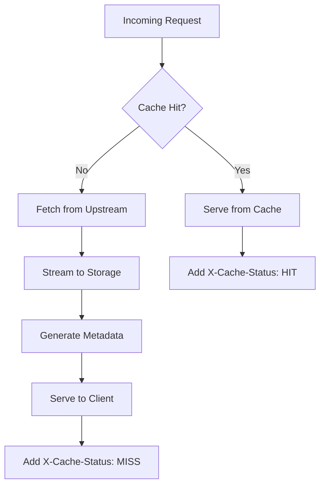

# TerraPeak Documentation

Comprehensive documentation for TerraPeak - Terraform Registry Caching Proxy.

## Table of Contents

- [Architecture Overview](#architecture-overview)
- [Storage Design](#storage-design)
- [Caching Strategy](#caching-strategy)
- [API Design](#api-design)
- [Configuration](#configuration)
- [Development Guide](#development-guide)
- [Testing](#testing)
- [Monitoring](#monitoring)
- [Performance](#performance)

## Architecture Overview

TerraPeak is designed as a high-performance caching proxy that sits between Terraform clients and the official Terraform Registry. It provides intelligent caching with multiple storage backends and transparent request proxying.

### Core Components

```
┌─────────────────┐    ┌─────────────────┐    ┌─────────────────┐
│   Terraform     │───▶│   TerraPeak     │───▶│  Terraform      │
│   Client        │    │   Proxy         │    │  Registry       │
└─────────────────┘    └─────────────────┘    └─────────────────┘
                              │
                              ▼
                       ┌─────────────────┐
                       │   Storage       │
                       │  (MinIO/File)   │
                       └─────────────────┘
```

### Application Structure

```
registry/
├── main.go              # Application entry point
├── api/                 # HTTP API layer
│   ├── api.go          # Core API service
│   ├── provider.go     # Provider-specific endpoints
│   └── module.go       # Module-specific endpoints
├── store/              # Storage abstraction layer
│   └── store.go        # MinIO/File storage implementation
├── config/             # Configuration management
│   └── config.go       # Configuration structure and loading
├── logger/             # Logging utilities
│   ├── logger.go       # Core logging setup
│   └── adapter.go      # HTTP middleware adapter
└── metrics/            # Health and metrics
    ├── health.go       # Health check endpoints
    └── metrics.go      # Application metrics
```

## Storage Design

### Dual Storage Backend

TerraPeak supports two storage backends that can be configured based on deployment needs:

#### MinIO Object Storage
- **Use Case**: Distributed deployments, high availability
- **Benefits**: Scalable, S3-compatible, metadata support
- **Storage**: Objects in S3-compatible buckets
- **Metadata**: Separate metadata objects with checksums

#### Local File System
- **Use Case**: Single-node deployments, development
- **Benefits**: Simple setup, no external dependencies
- **Storage**: Direct file system writes
- **Metadata**: Sidecar `.metadata.json` and `.success` files

### Storage Interface

```go
type Store struct {
    config *config.Config
    client *minio.Client // nil for file storage
}

// Core methods
func (s *Store) HandleRequest(w http.ResponseWriter, r *http.Request)
func (s *Store) FileExists(filePath string) bool
func (s *Store) ReadFromStorage(filePath string) ([]byte, error)
func (s *Store) Save(filename string, data []byte) error
```

### File Organization

#### File System Layout
```
./registry/
├── registry/v1/                    # API response cache
│   ├── versions/                   # Provider version lists
│   │   └── {namespace}/{name}
│   └── download/                   # Download metadata
│       └── {namespace}/{name}/{version}/{os}/{arch}
├── releases.hashicorp.com/         # Provider binaries
│   └── terraform-provider-{name}/{version}/
│       ├── terraform-provider-{name}_{version}_{os}_{arch}.zip
│       ├── terraform-provider-{name}_{version}_{os}_{arch}.zip.metadata.json
│       └── terraform-provider-{name}_{version}_{os}_{arch}.zip.success
└── github.com/                     # Module archives
    └── {owner}/{repo}/archive/{ref}.tar.gz
```

#### MinIO Object Layout
```
bucket: terrapeak-cache
├── registry/v1/versions/{namespace}/{name}
├── registry/v1/download/{namespace}/{name}/{version}/{os}/{arch}
├── releases.hashicorp.com/terraform-provider-{name}/{version}/{file}
└── releases.hashicorp.com/terraform-provider-{name}/{version}/{file}.metadata.json
```

## Caching Strategy

### Cache Key Design

Cache keys follow a hierarchical structure for efficient organization:

- **API Responses**: `registry/v1/{type}/{namespace}/{name}[/{version}][/{os}][/{arch}]`
- **Provider Binaries**: `{original-url-path}`
- **Module Archives**: `{original-url-path}`

### Cache Workflow



### Cache Headers

- `X-Cache-Status: HIT` - Content served from cache
- `X-Cache-Status: MISS` - Content fetched from upstream

### Streaming Architecture

TerraPeak implements efficient streaming to avoid memory pressure:

```go
// Stream directly to storage while serving client
reader := io.TeeReader(sourceStream, hashWriter)
multiWriter := io.MultiWriter(responseWriter, storageWriter)
io.Copy(multiWriter, reader)
```

## API Design

### Registry Compatibility

TerraPeak implements the Terraform Registry API specification:

- **Discovery**: `/.well-known/terraform.json`
- **Provider Versions**: `/v1/providers/{namespace}/{name}/versions`
- **Provider Download**: `/v1/providers/{namespace}/{name}/{version}/download/{os}/{arch}`
- **Module Versions**: `/v1/modules/{namespace}/{name}/{provider}/versions`

### URL Rewriting

Provider download URLs are rewritten to point back to TerraPeak:

```go
func AppFirstURL(base any, cacherURL string) any {
    // Transform: https://releases.hashicorp.com/terraform-provider-aws/5.0.0/...
    // To: https://terrapeak.domain.com/releases.hashicorp.com/terraform-provider-aws/5.0.0/...
}
```

### Error Handling

- **Upstream Unavailable**: Serve cached content if available
- **Cache Miss**: Transparent proxy to upstream
- **Storage Errors**: Log and fallback to upstream
- **Invalid Requests**: Standard HTTP error responses

## Configuration

### Configuration Structure

```go
type Config struct {
    Server struct {
        Addr         string `yaml:"addr"`
        ReadTimeout  int    `yaml:"read_timeout"`
        WriteTimeout int    `yaml:"write_timeout"`
        IdleTimeout  int    `yaml:"idle_timeout"`
        Domain       string `yaml:"domain"`
    } `yaml:"server"`

    Log struct {
        Level string `yaml:"level"`
    } `yaml:"log"`

    Terraform struct {
        RegistryUrl string `yaml:"registry_url"`
    } `yaml:"terraform"`

    Storage struct {
        Minio struct {
            Enabled       bool   `yaml:"enabled"`
            Endpoint      string `yaml:"endpoint"`
            Region        string `yaml:"region"`
            AccessKey     string `yaml:"access_key"`
            SecretKey     string `yaml:"secret_key"`
            Bucket        string `yaml:"bucket"`
            SkipSSLVerify bool   `yaml:"skip_ssl_verify"`
        } `yaml:"minio"`
        File struct {
            Path string `yaml:"path"`
        } `yaml:"file"`
    } `yaml:"storage"`
}
```

### Configuration Loading

```go
func Load(path string) (*Config, error) {
    // YAML file parsing with validation
    // Environment variable override support
    // Default value assignment
}
```

## Development Guide

### Code Organization

- **Separation of Concerns**: Each package has a single responsibility
- **Dependency Injection**: Configuration passed to constructors
- **Interface-Based Design**: Storage abstraction allows multiple backends
- **Error Handling**: Comprehensive error propagation and logging

### Key Design Patterns

1. **Strategy Pattern**: Storage backend selection
2. **Adapter Pattern**: HTTP middleware integration
3. **Proxy Pattern**: Transparent upstream proxying
4. **Factory Pattern**: Component initialization

### Adding New Features

1. **Storage Operations**: Extend the `Store` interface
2. **API Endpoints**: Add handlers to `api` package
3. **Configuration**: Update `Config` struct and validation
4. **Middleware**: Implement in `logger` or `metrics` packages

## Testing

### Testing Strategy

- **Unit Tests**: Individual component testing in isolation
- **Integration Tests**: Full application workflow testing
- **API Tests**: HTTP endpoint testing with mock servers
- **Performance Tests**: Benchmark testing for critical paths

### Test Categories

```
registry/
├── *_test.go           # Unit tests alongside source files
├── integration_test.go # Full application integration tests
├── run_tests.sh       # Test automation script
└── Makefile           # Build and test targets
```

### Coverage Requirements

- **Minimum Coverage**: 60% overall
- **Critical Paths**: 90% coverage for storage and API
- **Error Handling**: All error paths must be tested

### Mock Usage

- **HTTP Servers**: `httptest.Server` for upstream mocking
- **Temporary Storage**: `os.MkdirTemp` for file system tests
- **Configuration**: Test-specific config objects

## Monitoring

### Structured Logging

TerraPeak uses structured JSON logging with zerolog:

```json
{
  "level": "info",
  "time": "2023-12-07T10:30:45.123Z",
  "method": "GET",
  "path": "/v1/providers/hashicorp/aws/versions",
  "status": 200,
  "bytes": 1024,
  "elapsed": "150ms",
  "remote_addr": "192.168.1.100:12345",
  "user_agent": "terraform/1.6.0",
  "message": "HTTP GET /v1/providers/hashicorp/aws/versions - 200 (OK) - 1024 bytes in 150ms"
}
```

### Log Levels

- **Debug**: Cache operations, internal state changes
- **Info**: Request/response logging, cache status
- **Warn**: Non-fatal issues, fallback operations
- **Error**: Service errors, upstream failures
- **Fatal**: Startup failures, critical errors

### Health Monitoring

- **Health Endpoint**: `/healthz` - Service availability
- **Metrics Endpoint**: `/metrics` - Application metrics
- **Storage Health**: Backend connectivity validation

### Observability

- **Request Tracing**: Unique request IDs
- **Performance Metrics**: Response times, cache hit rates
- **Error Tracking**: Error categorization and alerting
- **Resource Usage**: Memory, disk, network utilization

## Performance

### Optimization Strategies

1. **Streaming**: Direct data streaming to avoid buffering
2. **Concurrent Processing**: Go routines for parallel operations
3. **Efficient Hashing**: Hardware-accelerated checksums
4. **Memory Management**: Minimal allocations, buffer reuse

### Performance Characteristics

- **Cache Hit**: Sub-10ms response times
- **Cache Miss**: Proxy overhead < 5ms
- **Streaming**: Memory usage constant regardless of file size
- **Concurrent Requests**: Handles 1000+ concurrent connections

### Benchmarking

```bash
# Run performance tests
go test -bench=. -benchmem ./...

# Load testing
make performance-test
```

### Scaling Considerations

- **Horizontal Scaling**: Multiple TerraPeak instances with shared MinIO
- **Vertical Scaling**: CPU/memory tuning for high throughput
- **Storage Scaling**: MinIO cluster for petabyte-scale caching
- **Network Optimization**: CDN integration for global distribution

---

For implementation details and code examples, refer to the source code in the `registry/` directory.
